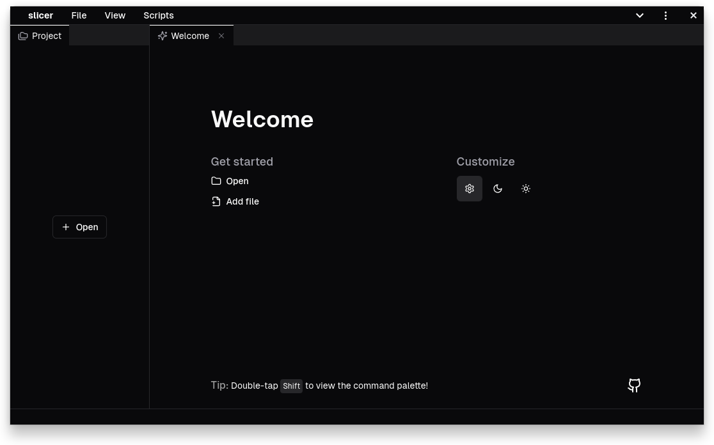

# slicer 

A modern Java reverse engineering tool for the web.

## Features

- disassembly and decompilation of Java class files
    - CFR, JASM, Vineflower, Procyon, ...
- bytecode control flow visualization via a [CFG](https://en.wikipedia.org/wiki/Control-flow_graph)
    - exportable to a PNG/SVG!
- low-level tabular view of a class file
- heap dump reading and summarization
- simple hexadecimal viewer for binary files
- a simple JS scripting API for doing various things
- multi-pane workspace for viewing multiple files at once
- [shadcn/ui](https://ui.shadcn.com/) design and theming support

## Installation

slicer and all decompilers/disassemblers run in the browser, no download necessary, just go to https://slicer.run!

If you want a desktop app (-ish) experience, you can also
[install slicer as a PWA](https://developer.mozilla.org/en-US/docs/Web/Progressive_web_apps/Guides/Installing).

## Motivation

All of this has stemmed from an experiment of running the [CFR](https://github.com/leibnitz27/cfr)
Java decompiler in a browser using TeaVM, which ended up working pretty well, so I made this thing around it.

slicer's being built for the sake of having fun building it, so don't expect any crazy features -
if you want to do serious reverse engineering, use [Recaf](https://github.com/Col-E/Recaf);
if you want to quickly look at a class file, and you don't want to set anything up locally, stay here.

_This is what happens when you let a backend developer do frontend, so enjoy the programmer art design._

## Licensing

slicer is licensed under the [MIT License](./LICENSE), however it also includes components
licensed under the [Apache License 2.0](https://www.apache.org/licenses/LICENSE-2.0),
such as the Vineflower and Procyon decompiler.
